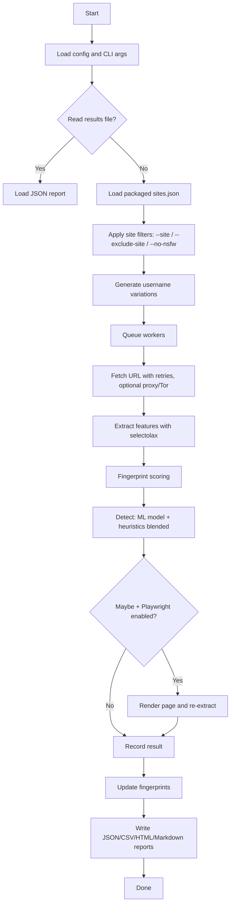
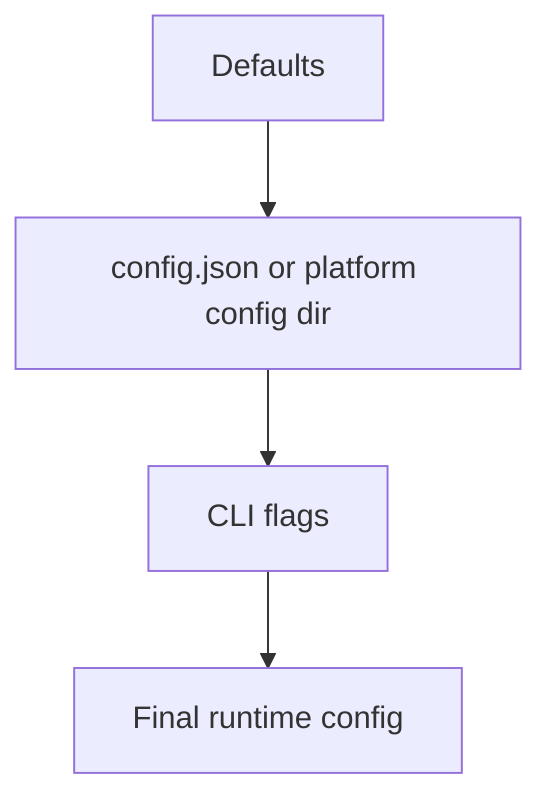

# Aliens Eye Working Notes

This document explains the runtime flow, data pipeline, and internal modules.

## High-level flow

## Module map

- `src/aliens_eye/cli.py`: argparse CLI, subcommands (`selfcheck`, `train`), interactive prompts
- `src/aliens_eye/core/analyzer.py`: HTML parsing and feature extraction (selectolax)
- `src/aliens_eye/core/http.py`: fetch with retries, backoff, response size caps, HTTP proxy
- `src/aliens_eye/core/rate_limit.py`: per-domain delay control
- `src/aliens_eye/core/detector.py`: ML + heuristic blended scoring and status selection
- `src/aliens_eye/core/fingerprints.py`: persisted match fingerprints by site
- `src/aliens_eye/core/scanner.py`: async queue workers, site filtering, SOCKS connector
- `src/aliens_eye/core/exporter.py`: JSON/CSV/HTML/Markdown report generation
- `src/aliens_eye/ml/inference.py`: pure-python model inference (no sklearn at runtime)
- `src/aliens_eye/ml/collect.py`: labeled dataset builder from ground-truth accounts
- `src/aliens_eye/ml/train.py`: sklearn training, exports coefficients to model.json
- `src/aliens_eye/selfcheck.py`: accuracy validation against known accounts
- `src/aliens_eye/utils/console.py`: rich-based progress, tables, panels
- `src/aliens_eye/data/`: sites.json, model.json, selfcheck.json, nsfw_sites.json, seed_dataset.csv

## Feature extraction

Signals include:
- HTTP status buckets (200, 3xx, 4xx, 5xx)
- Presence of username in URL path
- Auth-related path patterns
- Positive and error keyword counts (content and meta)
- DOM counts (img, form, input, profile/error class hints)
- Response time and content length
- Redirect count
- Fingerprint match counts
- Heuristic score (fed to the ML model as a feature)

These are stored as a consistent feature schema (`core/features.py`) shared by the
heuristic engine, training, and inference.

## Detection logic

Two judges vote on every response:

1. **Heuristic engine** — weighted score over the features, squashed to a
   probability with a sigmoid.
2. **ML model** — logistic regression trained offline with sklearn and exported
   to `data/model.json` (scaler stats + coefficients). Inference is a pure-python
   dot product, so the installed package has no ML dependencies.

The final probability is `0.4 * ml + 0.6 * heuristic`, mapped to
Found (> 0.6) / Not Found (< 0.35) / Maybe, with confidence scaled by distance
from the threshold. If the model file is missing or invalid, detection falls
back to heuristics alone.

### Training pipeline

- `aliens_eye train collect` scans ground-truth accounts from
  `data/selfcheck.json` (label 1) and randomized non-existent usernames
  (label 0), writing one feature row per scan.
- `aliens_eye train fit` trains LogisticRegression + StandardScaler and exports
  the model JSON. Blend weights and thresholds in `core/detector.py` were
  calibrated by out-of-fold grid search on the seed dataset.
- `aliens_eye selfcheck` measures live accuracy on the positives.

## Fingerprints

Fingerprints store compact signatures of known Found and Not Found pages per site:
- title hash
- meta hash
- DOM signature
- server header

During detection, similarity scores are added as features to reduce false positives.
The cache lives in the platform cache dir (via `platformdirs`), not in the package.

## Retry and rate limiting

- Retryable statuses: 408, 429, 500, 502, 503, 504
- Backoff: exponential with jitter and optional Retry-After handling
- Per-domain delay: prevents hammering a single host

## Proxies

- `http://` / `https://` proxies are passed per-request to aiohttp
- `socks4://` / `socks5://` proxies replace the connector with
  `aiohttp_socks.ProxyConnector` (`--tor` is shorthand for `socks5://127.0.0.1:9050`)

## Playwright fallback (optional)

If enabled, Playwright is used only when a result is Maybe. The rendered DOM is
re-parsed and can upgrade confidence. Install with `pip install aliens-eye[browser]`.

## Output pipeline

Reports are timestamped and written to:
- JSON (full detail)
- CSV (flat table)
- HTML (shareable summary)
- Markdown (Found/Maybe digest)

## Config precedence

