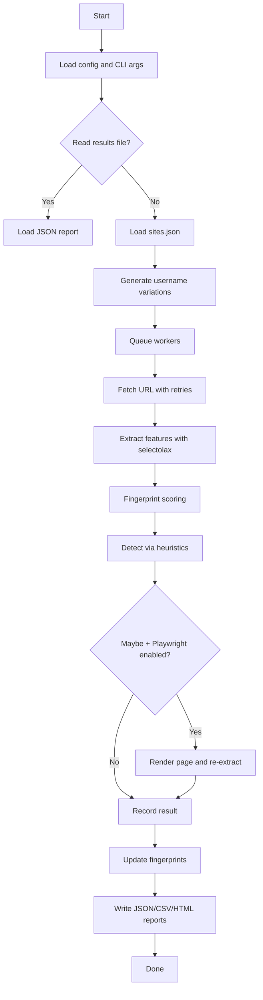
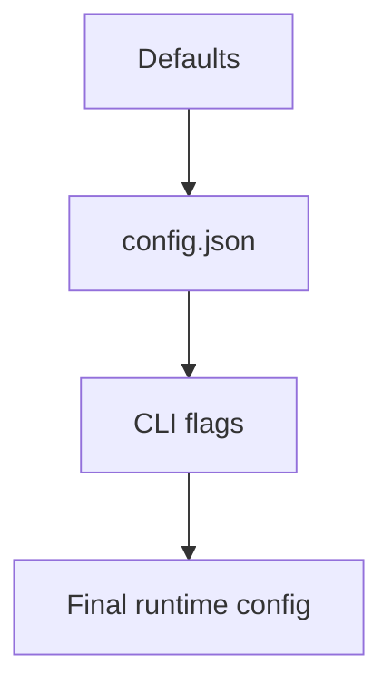

# Aliens Eye Working Notes

This document explains the runtime flow, data pipeline, and internal modules.

## High-level flow

## Module map

- core/analyzer.py: HTML parsing and feature extraction (selectolax)
- core/http.py: Fetch with retries, backoff, and response size caps
- core/rate_limit.py: Per-domain delay control
- core/detector.py: Heuristic scoring and status selection
- core/fingerprints.py: Persisted match fingerprints by site
- core/scanner.py: Async queue workers and orchestration
- core/exporter.py: JSON/CSV/HTML report generation

## Feature extraction

Signals include:
- HTTP status buckets (200, 3xx, 4xx, 5xx)
- Presence of username in URL path
- Auth-related path patterns
- Positive and error keyword counts (content and meta)
- DOM counts (img, form, input, profile/error class hints)
- Response time and content length
- Redirect count
- Fingerprint match counts

These are stored as a consistent feature schema and used for heuristic scoring.

## Detection logic

### Heuristic path

If no model is loaded, a weighted score is computed from the features. Thresholds map to:
- Found
- Not Found
- Maybe

## Dataset logging

Dataset logging was removed to keep the project focused on live heuristic detection.

## Fingerprints

Fingerprints store compact signatures of known Found and Not Found pages per site:
- title hash
- meta hash
- DOM signature
- server header

During detection, similarity scores are added as features to reduce false positives.

## Retry and rate limiting

- Retryable statuses: 408, 429, 500, 502, 503, 504
- Backoff: exponential with jitter and optional Retry-After handling
- Per-domain delay: prevents hammering a single host

## Playwright fallback (optional)

If enabled, Playwright is used only when a result is Maybe. The rendered DOM is re-parsed and can upgrade confidence.

## Output pipeline

Reports are timestamped and written to:
- JSON (full detail)
- CSV (flat table)
- HTML (shareable summary)

## Config precedence

