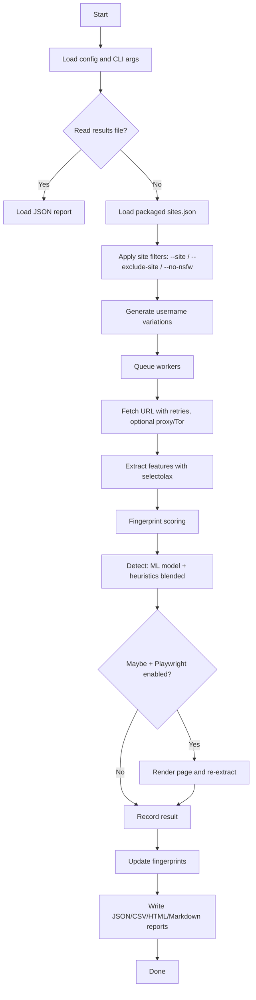
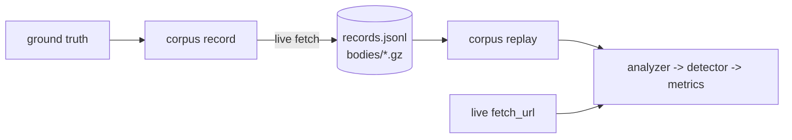
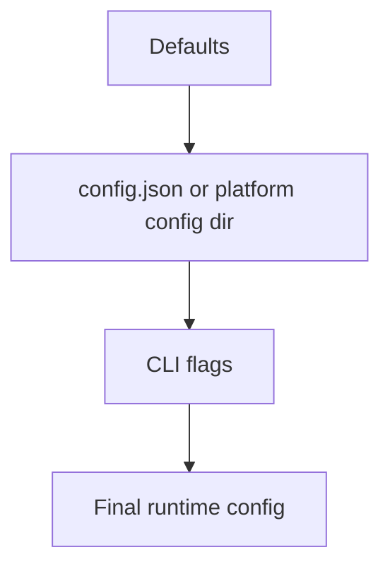

# Aliens Eye Working Notes

This document explains the runtime flow, data pipeline, and internal modules.

## High-level flow


```mermaid
flowchart TD
    A[Start] --> B[Load config and CLI args]
    B --> C{Read results file?}
    C -->|Yes| D[Load JSON report]
    C -->|No| E[Load packaged sites.json]
    E --> E2[Apply site filters: --site / --exclude-site / --no-nsfw]
    E2 --> F[Generate username variations]
    F --> G[Queue workers]
    G --> H[Fetch URL with retries, optional proxy/Tor]
    H --> I[Extract features with selectolax]
    I --> J[Fingerprint scoring]
    J --> K[Detect: ML model + heuristics blended]
    K --> L{Maybe + Playwright enabled?}
    L -->|Yes| M[Render page and re-extract]
    L -->|No| N[Record result]
    M --> N
    N --> O[Update fingerprints]
    O --> P[Write JSON/CSV/HTML/Markdown reports]
    P --> Q[Done]
```

## Module map

- `src/aliens_eye/cli.py`: argparse CLI, subcommands (`selfcheck`, `train`), interactive prompts
- `src/aliens_eye/core/analyzer.py`: HTML parsing and feature extraction (selectolax)
- `src/aliens_eye/core/http.py`: fetch with retries, backoff, response size caps, HTTP proxy
- `src/aliens_eye/core/rate_limit.py`: per-domain delay control
- `src/aliens_eye/core/detector.py`: ML + heuristic blended scoring and status selection
- `src/aliens_eye/core/fingerprints.py`: persisted match fingerprints by site
- `src/aliens_eye/core/scanner.py`: async queue workers, site filtering, SOCKS connector
- `src/aliens_eye/core/exporter.py`: JSON/CSV/HTML/Markdown report generation
- `src/aliens_eye/corpus/store.py`: on-disk corpus layout (records + content-addressed bodies)
- `src/aliens_eye/corpus/record.py`: capture live responses into a corpus
- `src/aliens_eye/corpus/replay.py`: serve a corpus back through the fetch interface
- `src/aliens_eye/ml/inference.py`: pure-python model inference (no sklearn at runtime)
- `src/aliens_eye/ml/collect.py`: labeled dataset builder from ground-truth accounts
- `src/aliens_eye/ml/train.py`: sklearn training, exports coefficients to model.json
- `src/aliens_eye/selfcheck.py`: accuracy validation against known accounts
- `src/aliens_eye/utils/console.py`: rich-based progress, tables, panels
- `src/aliens_eye/data/`: sites.json, model.json, selfcheck.json, nsfw_sites.json, seed_dataset.csv

## Feature extraction

Signals include:
- HTTP status buckets (200, 3xx, 4xx, 5xx)
- Presence of username in URL path
- Auth-related path patterns
- Positive and error keyword counts (content and meta)
- DOM counts (img, form, input, profile/error class hints)
- Response time and content length
- Redirect count
- Fingerprint match counts
- Heuristic score (fed to the ML model as a feature)

These are stored as a consistent feature schema (`core/features.py`) shared by the
heuristic engine, training, and inference.

## Detection logic

Two judges vote on every response:

1. **Heuristic engine** — weighted score over the features, squashed to a
   probability with a sigmoid.
2. **ML model** — logistic regression trained offline with sklearn and exported
   to `data/model.json` (scaler stats + coefficients). Inference is a pure-python
   dot product, so the installed package has no ML dependencies.

The final probability is `w * ml + (1 - w) * heuristic`. **The loaded model
supplies `w` and both thresholds**; the constants in `core/detector.py`
(`ML_WEIGHT = 0.4`, `FOUND_THRESHOLD = 0.6`, `NOT_FOUND_THRESHOLD = 0.35`) are
only fallbacks for when no model loads or a model file omits the fields.

| | ml weight | Found > | Not Found < |
|---|---|---|---|
| Shipped `data/model.json` (default runtime) | **0.6** | **0.5559** | **0.3224** |
| Fallback constants (heuristic-only / fields absent) | 0.4 | 0.6 | 0.35 |

Confidence is scaled by distance from the threshold. If the model file is
missing or invalid, detection falls back to heuristics alone.
`tests/test_detector.py` pins the shipped model's values against this table, so
the two cannot drift apart silently.

### Frozen response corpus

Evaluating against the live web is not reproducible: platforms change markup,
rate-limit differently day to day, and block some networks outright, so a change
in measured accuracy cannot be attributed to the detector. `corpus/` removes the
network from the measurement loop.


```mermaid
flowchart LR
    A[ground truth] --> B[corpus record]
    B -->|live fetch| C[(records.jsonl<br/>bodies/*.gz)]
    C --> D[corpus replay]
    D --> E[analyzer -> detector -> metrics]
    F[live fetch_url] --> E
```

`fetch_url` is the only seam between the scanner and the network, so replay
substitutes *just* that callable. Feature extraction, scoring and vectorisation
run byte-identical code on live and replayed responses, which means an evaluation
measures the detector rather than the harness.

Determinism needs three things beyond stored bytes:

1. The rate limiter is not consulted, so replay never sleeps and wall-clock
   timing cannot leak into results.
2. `response_time` is the recorded value, not a fresh measurement.
3. The fingerprint store must be read-only. `FingerprintStore` accumulates
   signatures *during* a scan and scores each response against whatever earlier
   responses happened to finish first — live, its contribution depends on async
   worker completion order. `FingerprintStore(path, read_only=True)` freezes it.

When `--corpus` is given, the corpus also supplies the **evaluation set**: rows
come from the recorded labels rather than from freshly generated usernames.
Regenerating them would produce URLs the corpus never captured, so every negative
would miss and the run would report a false-positive rate over an empty negative
class.

```bash
aliens_eye corpus record --out paper/corpus/v1 --split all --negatives 4 --seed 1234
aliens_eye corpus stats paper/corpus/v1
aliens_eye selfcheck --split holdout --corpus paper/corpus/v1 --report json
```

Negatives are generated in two kinds, tagged per record: `random` (14-20 random
alphanumerics) and `plausible` (ordinary word morphology, e.g. `quietfalcon84`).
A pool of only random strings is an artificially easy negative class — separable
on length and character distribution alone — and inflates every metric.
Plausible negatives are not verified absent by construction; see
`paper/corpus/README.md`.

### Ablation harness

`aliens_eye eval ablate --corpus DIR` scores several detector configurations over
the same frozen corpus: naive status baselines, each judge in isolation, the
shipped blend, and one run per zeroed feature group. Features are extracted once
per response and shared across configurations, so a difference in the table is a
difference in the configuration and not in the harness.

Every row carries a **percentile-bootstrap 95% CI on F1**, and every non-reference
row a **paired-bootstrap CI on the F1 difference** against the shipped blend.
Paired, because all configurations score the same rows. A difference whose CI
spans zero is reported as `ns` — on corpora this small most differences are not
resolvable, and the table says so rather than inviting a reader to rank noise.

The **Maybe rate** is reported alongside precision. Detection is tri-state, so a
configuration can inflate precision by abstaining on everything hard; quoting
precision without the abstention rate beside it would be misleading.

See `paper/baselines/README.md` for current results. The short version: on corpus
v1 the ML model alone significantly outperforms both a naive status check and the
shipped blend, and the heuristic engine — which holds 40% of the shipped vote —
is not distinguishable from `if status == 200`.

### External baselines

`aliens_eye eval external --corpus DIR --sherlock PATH --whatsmyname PATH` runs
those projects' own per-site rules over the stored responses, so the comparison
isolates detection logic from HTTP behaviour. Rule data is **not vendored** —
fetch it from upstream and mind the licence (Sherlock MIT; WhatsMyName CC BY-SA
4.0). Each run records the rule file's sha256.

Rows a tool has no rule for, or that its rules leave undecided, are **excluded
from its score** rather than counted against it; the covered-row count is reported
alongside. Charging a tool for sites it never claimed to support would understate
it — and WhatsMyName in particular decides only a small fraction of rows.

### Ground-truth splits

Ground truth is **site-disjoint** across two files:

- `data/selfcheck.json` — train split (30 sites, 45 positives). The only split
  `train collect` reads.
- `data/eval_holdout.json` — holdout (13 sites, 15 positives). Never seen by
  training.

The split is by site, not by account: the detector learns per-site page
structure, so holding out only accounts from an already-trained site would
overstate generalization. `aliens_eye selfcheck --split holdout` measures
generalization to unseen platforms; `--split train` measures fit and reads
optimistically high. `train collect --split holdout` is refused unless
`--allow-leakage` is passed.

### Training pipeline

- `aliens_eye train collect` scans ground-truth accounts from the train split
  (label 1) and randomized non-existent usernames (label 0), writing one
  feature row per scan.
- `aliens_eye train fit` trains LogisticRegression + StandardScaler and exports
  the model JSON, including the blend weight and thresholds calibrated by
  out-of-fold grid search.
- `aliens_eye selfcheck --split holdout` measures live accuracy on sites the
  model never trained on.

> **Known limitation.** The shipped model reports `cv_f1 = 0.5622` over 368
> samples (97 positive / 271 negative) drawn from 43 sites. That is a small,
> celebrity-skewed sample and the figure should be read as preliminary.

## Fingerprints

Fingerprints store compact signatures of known Found and Not Found pages per site:
- title hash
- meta hash
- DOM signature
- server header

During detection, similarity scores are added as features to reduce false positives.
The cache lives in the platform cache dir (via `platformdirs`), not in the package.

## Retry and rate limiting

- Retryable statuses: 408, 429, 500, 502, 503, 504
- Backoff: exponential with jitter and optional Retry-After handling
- Per-domain delay: prevents hammering a single host

## Proxies

- `http://` / `https://` proxies are passed per-request to aiohttp
- `socks4://` / `socks5://` proxies replace the connector with
  `aiohttp_socks.ProxyConnector` (`--tor` is shorthand for `socks5://127.0.0.1:9050`)

## Playwright fallback (optional)

If enabled, Playwright is used only when a result is Maybe. The rendered DOM is
re-parsed and can upgrade confidence. Install with `pip install aliens-eye[browser]`.

## Output pipeline

Reports are timestamped and written to:
- JSON (full detail)
- CSV (flat table)
- HTML (shareable summary)
- Markdown (Found/Maybe digest)

## Config precedence


```mermaid
flowchart TD
    A[Defaults] --> B[config.json or platform config dir]
    B --> C[CLI flags]
    C --> D[Final runtime config]
```
